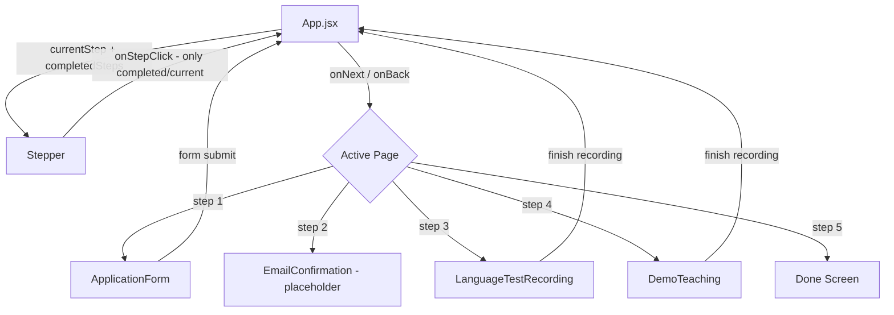

# ARCHITECTURE — System Architecture
## 123 ENGLISH Teacher Application Portal

### 1. Tech Stack

| Layer | Technology | Version |
|-------|-----------|---------|
| Runtime | Node.js | 18+ |
| Build | Vite | 7.x |
| Framework | React | 18.x |
| Styling | Tailwind CSS | 3.x |
| Icons | Lucide React | latest |
| Font | Inter (Google Fonts) | — |

### 2. Cấu trúc thư mục

```
PRO_teacher-application-portal/
├── docs/ai/                    # AI documentation
│   ├── PRD.md
│   ├── ARCHITECTURE.md
│   ├── CONVENTIONS.md
│   ├── CONTEXT.md
│   └── REVIEW_CHECKLIST.md
├── public/                     # Static assets
├── src/
│   ├── components/             # Reusable UI components
│   │   ├── Header.jsx          # App header with branding
│   │   └── Stepper.jsx         # Progress stepper with step-locking
│   ├── pages/                  # Page-level components (1 per step)
│   │   ├── ApplicationForm.jsx # Step 1: Registration form
│   │   ├── LanguageTestRecording.jsx  # Step 3: Language test
│   │   └── DemoTeaching.jsx    # Step 4: Demo teaching recording
│   ├── App.jsx                 # Root component, step routing, completedSteps
│   ├── main.jsx                # React entry point
│   └── index.css               # Global styles + Tailwind directives
├── index.html                  # HTML template
├── tailwind.config.js          # Tailwind theme customization
├── postcss.config.js           # PostCSS plugin config
├── vite.config.js              # Vite build config
└── package.json
```

### 3. Luồng dữ liệu (Data Flow)



### 4. Module Interaction

| Module | Responsibility | Dependencies |
|--------|---------------|-------------|
| `App.jsx` | Step state + completedSteps management, routing, layout | Header, Stepper, Pages |
| `Header.jsx` | Brand display, navigation icons | lucide-react |
| `Stepper.jsx` | Visual progress indicator, step-locking (lock icon for future steps) | lucide-react |
| `ApplicationForm.jsx` | Form inputs, validation, submission | lucide-react |
| `LanguageTestRecording.jsx` | Q&A display, camera UI, countdown, mic level | lucide-react |
| `DemoTeaching.jsx` | Demo lesson recording, countdown, timer, tips | lucide-react |

### 5. Thiết kế mở rộng (Future)

- Thêm pages mới: tạo file trong `src/pages/`, import vào `App.jsx` switch-case.
- Backend integration: tạo `src/services/api.js` để gọi REST API.
- State management: nâng cấp lên Context API hoặc Zustand nếu state phức tạp.
- Routing: chuyển sang `react-router-dom` khi cần URL-based navigation.
- WebRTC: tạo `src/hooks/useCamera.js` và `src/hooks/useMicrophone.js` cho camera/mic thực.
